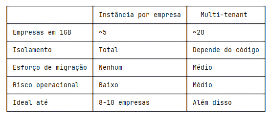
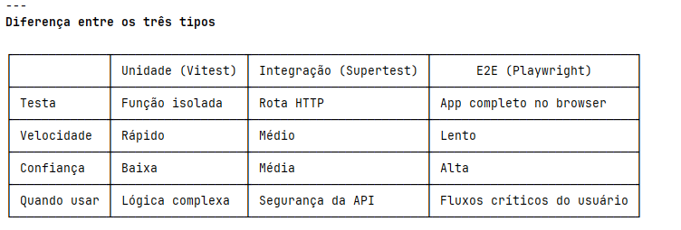

# React + TypeScript + Vite

This template provides a minimal setup to get React working in Vite with HMR and some ESLint rules.

Currently, two official plugins are available:

- [@vitejs/plugin-react](https://github.com/vitejs/vite-plugin-react/blob/main/packages/plugin-react) uses [Oxc](https://oxc.rs)
- [@vitejs/plugin-react-swc](https://github.com/vitejs/vite-plugin-react/blob/main/packages/plugin-react-swc) uses [SWC](https://swc.rs/)

## React Compiler

The React Compiler is not enabled on this template because of its impact on dev & build performances. To add it, see [this documentation](https://react.dev/learn/react-compiler/installation).

## Expanding the ESLint configuration

If you are developing a production application, we recommend updating the configuration to enable type-aware lint rules:

```js
export default defineConfig([
  globalIgnores(['dist']),
  {
    files: ['**/*.{ts,tsx}'],
    extends: [
      // Other configs...

      // Remove tseslint.configs.recommended and replace with this
      tseslint.configs.recommendedTypeChecked,
      // Alternatively, use this for stricter rules
      tseslint.configs.strictTypeChecked,
      // Optionally, add this for stylistic rules
      tseslint.configs.stylisticTypeChecked,

      // Other configs...
    ],
    languageOptions: {
      parserOptions: {
        project: ['./tsconfig.node.json', './tsconfig.app.json'],
        tsconfigRootDir: import.meta.dirname,
      },
      // other options...
    },
  },
])
```

You can also install [eslint-plugin-react-x](https://github.com/Rel1cx/eslint-react/tree/main/packages/plugins/eslint-plugin-react-x) and [eslint-plugin-react-dom](https://github.com/Rel1cx/eslint-react/tree/main/packages/plugins/eslint-plugin-react-dom) for React-specific lint rules:

```js
// eslint.config.js
import reactX from 'eslint-plugin-react-x'
import reactDom from 'eslint-plugin-react-dom'

export default defineConfig([
  globalIgnores(['dist']),
  {
    files: ['**/*.{ts,tsx}'],
    extends: [
      // Other configs...
      // Enable lint rules for React
      reactX.configs['recommended-typescript'],
      // Enable lint rules for React DOM
      reactDom.configs.recommended,
    ],
    languageOptions: {
      parserOptions: {
        project: ['./tsconfig.node.json', './tsconfig.app.json'],
        tsconfigRootDir: import.meta.dirname,
      },
      // other options...
    },
  },
])
```
Install

npm install
npm install sqlite3
npm install -D @types/sqlite3
npm install express cors
npm install -D @types/express @types/cors ts-node

rodar 
npm run dev

npx ts-node src/backend/server.ts


public ip: 163.176.188.254

Deploy do Sistema EPI na Oracle Cloud Free Tier (São Paulo)

1. Criamos uma VM Ubuntu 22.04 na Oracle Cloud
2. Configuramos a rede (IP público, regras de firewall)
3. Instalamos Node.js, nginx, PM2 e tsx no servidor
4. Enviamos o projeto via SCP
5. Rodamos npm install e npm run build
6. Corrigimos o sqlite3 recompilando com build-from-source
7. Iniciamos o backend com PM2 usando tsx
8. Configuramos o nginx como proxy reverso
9. Resolvemos bloqueios do iptables e permissões
10. Movemos o dist para /var/www/html/app

App rodando em http://163.176.188.254 🎉


● URL customizada:
Sim, precisa comprar um domínio (ex: seuapp.com.br) em registros como Registro.br (~R$40/ano) ou GoDaddy. Depois aponta o DNS para o IP 163.176.188.254 e configura o nginx com o domínio. Também dá para adicionar HTTPS
gratuito com Let's Encrypt.


● Existem duas abordagens:

Opção 1 — Instância separada por empresa (mais simples)
- Copia a pasta do app para /home/ubuntu/empresa1, /home/ubuntu/empresa2, etc.
- Cada backend roda numa porta diferente (3001, 3002...)
- Cada empresa tem seu próprio SQLite isolado
- No nginx, configura subdomínios: empresa1.seuapp.com, empresa2.seuapp.com
- Limitação: a VM free tem 1GB de RAM, comporta ~5-10 empresas


cd /mnt/c/Users/vitor/OneDrive/Projetos/vitejs-vite-hfwmqfrm
bash deploy.sh

● Sim, a forma mais comum é subdomínio por empresa:

empresa1.seuapp.com.br                                                                                                                                                                                                      
empresa2.seuapp.com.br

Como funciona:
1. Compra um domínio (ex: seuapp.com.br)
2. No DNS, cria um wildcard *.seuapp.com.br → 163.176.188.254 — assim qualquer subdomínio já aponta pro servidor
3. No nginx, cada empresa tem seu próprio bloco server com server_name empresa1.seuapp.com.br apontando para a porta do backend dela

● Comandos executados no servidor (via SSH)

# Instalar dependências
curl -fsSL https://deb.nodesource.com/setup_20.x | sudo -E bash -                                                                                                                                                                                                                                           
sudo apt install -y nodejs nginx build-essential
sudo npm install -g pm2 tsx

# Enviar projeto (WSL local)
scp -i ~/Downloads/ssh-key-2026-04-26.key -r /mnt/c/Users/vitor/OneDrive/Projetos/vitejs-vite-hfwmqfrm/. ubuntu@163.176.188.254:/home/ubuntu/app

# Instalar dependências do projeto
cd /home/ubuntu/app
npm install

# Recompilar sqlite3
npm install sqlite3 --build-from-source

# Build do frontend
npm run build

# Iniciar backend com PM2
pm2 start "tsx src/backend/server.ts" --name backend
pm2 save
pm2 startup

# Copiar dist para pasta do nginx
sudo cp -r /home/ubuntu/app/dist /var/www/html/app
sudo chown -R www-data:www-data /var/www/html/app

# Configurar nginx
sudo nano /etc/nginx/sites-available/app
sudo ln -s /etc/nginx/sites-available/app /etc/nginx/sites-enabled/
sudo rm /etc/nginx/sites-enabled/default
sudo systemctl reload nginx

# Abrir portas no firewall
sudo ufw allow 80
sudo ufw allow 22
sudo ufw enable

# Remover regra iptables bloqueante
---
Remover regra bloqueante do iptables

O Oracle Cloud adiciona por padrão uma regra que bloqueia todo tráfego de entrada antes do UFW processar. É necessário removê-la.

# 1. Listar as regras para identificar o número da regra REJECT
sudo iptables -L INPUT --line-numbers

Procure a linha com **_REJECT_** e **_icmp-host-prohibited_** — geralmente é a regra número 5:

num  target   prot  source    destination

...

5    REJECT   all   anywhere  anywhere   reject-with icmp-host-prohibited

# 2. Remover a regra pelo número encontrado (ex: 5)
sudo iptables -D INPUT 5

▎ Atenção: o número pode variar. Sempre confirme com o primeiro comando antes de deletar.


Conteúdo do /etc/nginx/sites-available/app
```
server {
    listen 80;

    root /var/www/html/app;
    index index.html;
    
    location /api/ {
      proxy_pass http://localhost:3000;
    }
    
    location / {
      try_files $uri $uri/ /index.html;
    }
}
```

1. Compra do domínio — segurid.com.br comprado no Registro.br
2. DNS — Adicionados dois registros A na zona DNS do Registro.br:
   - segurid.com.br → 163.176.188.254
   - www.segurid.com.br → 163.176.188.254
3. Certificado SSL — Instalado o Certbot (cliente Let's Encrypt) no servidor e gerado o certificado para segurid.com.br e www.segurid.com.br. Validade: 90 dias com renovação automática configurada.
4. Nginx — Atualizado o arquivo /etc/nginx/sites-available/app com:
   - Redirecionamento automático HTTP → HTTPS
   - SSL com o certificado do Let's Encrypt
   - Proxy /api/ → backend na porta 3000
   - Root apontando para /var/www/html/app (onde ficam os arquivos do frontend)
5. Resultado — App acessível em https://segurid.com.br com câmera funcionando via HTTPS.

como subir
npx vite build
bash deploy.sh --skip-build

---                                                                                                                                                                                                                                                                                                         
#2 — apiFetch fora do setState (App.tsx)
Os três handlers (handleSetEntregas, handleSetFuncionarios, handleSetEpis) foram refatorados. Agora leem o estado atual via entregasRef.current / funcionariosRef.current / episRef.current (refs que espelham o state a cada render), computam o diff e disparam os apiFetch antes de chamar               
setEntregas/setFuncionarios/setEpis(next) — que agora é uma chamada pura sem side-effects. Em criarFuncionario foi adicionado funcionariosEnviadosRef.current.add(data.id) para garantir que o dedup guard cobre esse caminho também (#8).

#4 — Token sumindo no refresh (api.ts)                                                                                                                                                                                                                                                                      
_token agora inicia com sessionStorage.getItem('epi_token'). setToken() sincroniza com o sessionStorage. Refresh da página preserva a sessão enquanto a aba estiver aberta.

#5 — 413 silencioso no POST de biometria (server.ts + BiometriaPage.tsx)
express.json({ limit: '2mb' }) resolve o limite de 100 KB. Além disso, a biometria facial agora só envia imagem_base64 quando não há descriptor_json — economiza ~300 KB na requisição quando o reconhecimento funcionou.

#6 — deleteBio atualizava UI mesmo com falha (BiometriaPage.tsx)
setFuncionarios e o toast agora ficam dentro do try, após confirmação de res.ok. Se a API falhar, a biometria permanece na lista e um toast de erro é exibido.

#7 — Rate limiter zerado no restart (database.ts + crud.ts + server.ts)
Tabela login_attempts no SQLite registra IP e timestamp de cada falha. O login handler consulta (bloqueadoPorRateLimit), registra falhas (registrarFalhaLogin) e limpa no sucesso (limparTentativasLogin). Persiste entre restarts do PM2/deploy.

● Cenário 1 — Instância por empresa (agora, até ~15)

Estrutura no servidor:                                                                                                                                                                                                                                                                                      
/opt/epi/
empresa-abc/                                                                                                                                                                                                                                                                                              
server.ts (ou build/)
bd_epi.sqlite
.env          ← PORT=3001
empresa-xyz/
server.ts
bd_epi.sqlite
.env          ← PORT=3002

Passo a passo:

1. Instalar dependências no servidor (uma vez)
   sudo apt install nodejs npm nginx
   npm install -g pm2 ts-node

2. Para cada nova empresa
# Clonar e configurar
cp -r /opt/epi/template /opt/epi/empresa-abc
cd /opt/epi/empresa-abc
echo "PORT=3001" > .env
echo "JWT_SECRET=segredo-unico-abc" >> .env

# Inicializar banco
npx ts-node src/backend/database.ts

# Iniciar processo
pm2 start "npx ts-node src/backend/server.ts" --name empresa-abc
pm2 save

3. Nginx — bloco por empresa
   server {
   server_name empresa-abc.seudominio.com;
   location / { proxy_pass http://localhost:3001; }
   }
   server {
   server_name empresa-xyz.seudominio.com;
   location / { proxy_pass http://localhost:3002; }
   }

4. SSL (uma vez por domínio)
   sudo certbot --nginx -d empresa-abc.seudominio.com

5. Deploy de atualização
   cd /opt/epi/empresa-abc && git pull
   pm2 restart empresa-abc

  ---
Cenário 2 — Multi-tenant (aos 15 empresas)

Estrutura:
/opt/epi/
app/           ← uma só cópia do código
data/
empresa-abc/bd.sqlite
empresa-xyz/bd.sqlite

Passo a passo de migração:

1. Mover bancos existentes
   mkdir -p /opt/epi/data/empresa-abc
   mv /opt/epi/empresa-abc/bd_epi.sqlite /opt/epi/data/empresa-abc/bd.sqlite
# repetir para cada empresa

2. Adaptar server.ts com o middleware de tenant (o que discutimos — JWT valida slug)
3. Um único processo
   cd /opt/epi/app
   pm2 delete empresa-abc empresa-xyz  # matar os N processos
   pm2 start "npx ts-node src/backend/server.ts" --name epi-app
   pm2 save

4. Nginx — um bloco só com wildcard
   server {
   server_name *.seudominio.com;
   location / { proxy_pass http://localhost:3000; }
   }

5. Provisionar nova empresa
# script: novo-cliente.sh <slug>
mkdir -p /opt/epi/dataCIFRAO1
 
npx ts-node src/backend/database.ts --tenant $1
# criar usuário admin no banco

  ---
Quando migrar: ao chegar em ~10 empresas já vale planejar a migração — o trabalho maior é adaptar server.ts e database.ts pra receber o tenant como parâmetro. Os bancos SQLite migram sem conversão.


● Instância por empresa

Prós
- Zero risco de vazamento entre tenants — processos completamente isolados
- Falha de uma empresa não afeta as outras
- Rollback por empresa: dá pra manter versões diferentes por cliente
- Deploy/atualização granular
- Debug simples: pm2 logs empresa-abc
- Sem mudança no código atual

Contras
- RAM cresce linear: ~150-200MB por instância → teto real de ~5 empresas em 1GB
- Atualizar 10 empresas = rodar o deploy 10 vezes
- Sem painel centralizado de uso/saúde (a menos que configure no PM2)
- Custo de servidor sobe antes do que no multi-tenant

  ---
Multi-tenant

Prós
- Um processo só: 15-20 empresas no mesmo 1GB confortavelmente
- Deploy único atualiza todos os clientes
- Mais fácil monitorar e logar em um lugar
- Escala sem trocar de servidor tão cedo

Contras
- Bug no código derruba todos os clientes ao mesmo tempo
- Exige mudança no server.ts, database.ts e no JWT
- Path traversal e cross-tenant são riscos reais que precisam de teste
- Rollback por cliente deixa de existir — ou você reverte todos ou nenhum
- Mais complexo pra debugar ("qual tenant causou isso?")

  ---
Resumo prático




 ---                                                                                                                                                                                                                                                                                                         
Setup (uma vez)

npm install -D vitest supertest @types/supertest

Em package.json:
"scripts": {
"test": "vitest run",
"test:watch": "vitest"
}

  ---
1. Path traversal — teste de unidade

Testa só a função de validação do slug, sem subir servidor.

// src/backend/slug.ts
export function slugValido(slug: string): boolean {
return /^[a-z0-9-]+$/.test(slug)
}

// src/backend/slug.test.ts
import { describe, it, expect } from 'vitest'
import { slugValido } from './slug'

describe('slugValido', () => {
it('aceita slugs normais', () => {
expect(slugValido('empresa-abc')).toBe(true)
expect(slugValido('cliente123')).toBe(true)
})

    it('rejeita path traversal', () => {
      expect(slugValido('../../etc/passwd')).toBe(false)
      expect(slugValido('../empresa-xyz')).toBe(false)
      expect(slugValido('empresa/abc')).toBe(false)
    })

    it('rejeita caracteres especiais', () => {
      expect(slugValido('empresa abc')).toBe(false)
      expect(slugValido('empresa_abc')).toBe(false)
      expect(slugValido('EMPRESA')).toBe(false)
    })
})

  ---
2. Cross-tenant — teste de integração

Sobe o servidor de verdade e faz requisições HTTP.

// src/backend/server.test.ts
import { describe, it, expect } from 'vitest'
import request from 'supertest'
import jwt from 'jsonwebtoken'
import app from './server' // server.ts precisa exportar o app

const SECRET = process.env.JWT_SECRET ?? 'test-secret'

function gerarToken(tenant: string) {
return jwt.sign({ userId: 1, tenant }, SECRET, { expiresIn: '1h' })
}

describe('Isolamento entre tenants', () => {
it('rejeita acesso sem token', async () => {
const res = await request(app).get('/empresa-abc/api/funcionarios')
expect(res.status).toBe(401)
})

    it('rejeita token de outro tenant', async () => {
      const token = gerarToken('empresa-xyz') // token de xyz...
      const res = await request(app)
        .get('/empresa-abc/api/funcionarios') // ...tentando acessar abc
        .set('Authorization', `Bearer ${token}`)

      expect(res.status).toBe(403)
    })

    it('permite acesso ao tenant correto', async () => {
      const token = gerarToken('empresa-abc')
      const res = await request(app)
        .get('/empresa-abc/api/funcionarios')
        .set('Authorization', `Bearer ${token}`)

      expect(res.status).toBe(200)
    })

    it('rejeita slug com path traversal', async () => {
      const token = gerarToken('../../etc')
      const res = await request(app)
        .get('/../../etc/api/funcionarios')
        .set('Authorization', `Bearer ${token}`)

      expect(res.status).toBe(400)
    })
})

  ---
Para o server.ts exportar o app

// no final de server.ts, trocar:
app.listen(3000)

// por:
if (require.main === module) {
app.listen(3000)
}
export default app

  ---
Rodar

npm test              # roda uma vez
npm run test:watch    # modo watch durante desenvolvimento


O equivalente moderno para React é Playwright. Testa o app de verdade no browser, simulando o usuário.
   
---                                                                                                                                                                                                                                                                                                         
Setup

npm install -D @playwright/test
npx playwright install chromium

playwright.config.ts:
import { defineConfig } from '@playwright/test'

export default defineConfig({
testDir: './e2e',
baseURL: 'http://localhost:5173',
webServer: {
command: 'npm run dev',
port: 5173,
reuseExistingServer: true,
},
})

  ---
Testes E2E para este app

// e2e/login.spec.ts
import { test, expect } from '@playwright/test'

test('login com credenciais válidas', async ({ page }) => {
await page.goto('/')
await page.fill('[name=usuario]', 'admin')
await page.fill('[name=senha]', '123456')
await page.click('button[type=submit]')

    await expect(page.locator('text=Dashboard')).toBeVisible()
})

test('login inválido mostra erro', async ({ page }) => {
await page.goto('/')
await page.fill('[name=usuario]', 'errado')
await page.fill('[name=senha]', 'errado')
await page.click('button[type=submit]')

    await expect(page.locator('text=Credenciais inválidas')).toBeVisible()
})

// e2e/entrega.spec.ts
import { test, expect } from '@playwright/test'

test.beforeEach(async ({ page }) => {
// login antes de cada teste
await page.goto('/')
await page.fill('[name=usuario]', 'admin')
await page.fill('[name=senha]', '123456')
await page.click('button[type=submit]')
})

test('criar nova entrega', async ({ page }) => {
await page.click('text=Nova Entrega')
await page.selectOption('[name=funcionario]', { index: 1 })
await page.click('text=Adicionar EPI')
await page.click('text=Confirmar Entrega')

    await expect(page.locator('text=Entrega criada')).toBeVisible()
})

test('logout redireciona para login', async ({ page }) => {
await page.click('text=Sair')
await expect(page).toHaveURL('/')
await expect(page.locator('[name=usuario]')).toBeVisible()
})

  ---
Rodar

npx playwright test              # headless
npx playwright test --headed     # abre o browser pra ver
npx playwright test --ui         # interface visual (ótima pra debugar)

  ---
Diferença entre os três tipos

- headless: roda em background, sem abrir o browser
- headed: abre o browser pra ver o teste sendo executado
- ui: abre uma interface visual pra debugar o teste



Checar


Sem backup — ainda real. VPS cai, dados somem.
Senha admin123 hardcoded no seed — todo cliente novo sobe com ela. Precisa forçar troca no primeiro login ou pelo menos avisar em tela.
GET /api/users sem soAdmin — qualquer operador vê lista de usuários.
Sem validação de input nos endpoints POST/PUT.
Sem log de auditoria — quem assinou, quem cancelou, quando. Para EPI isso é crítico em fiscalização trabalhista.
